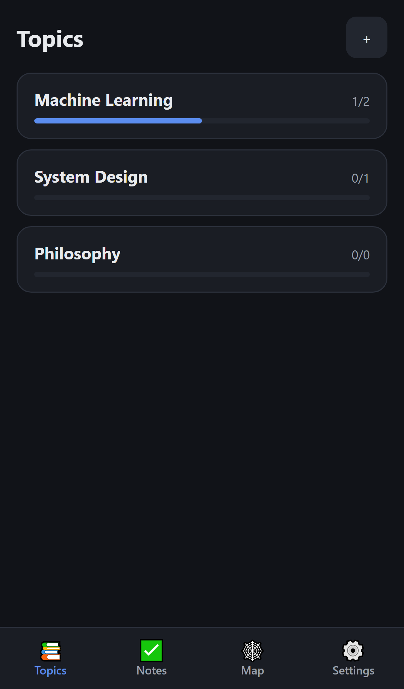
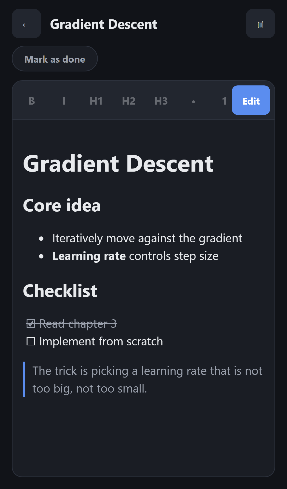
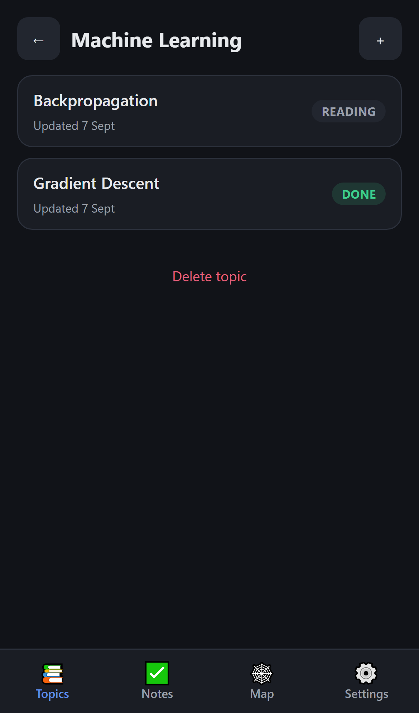
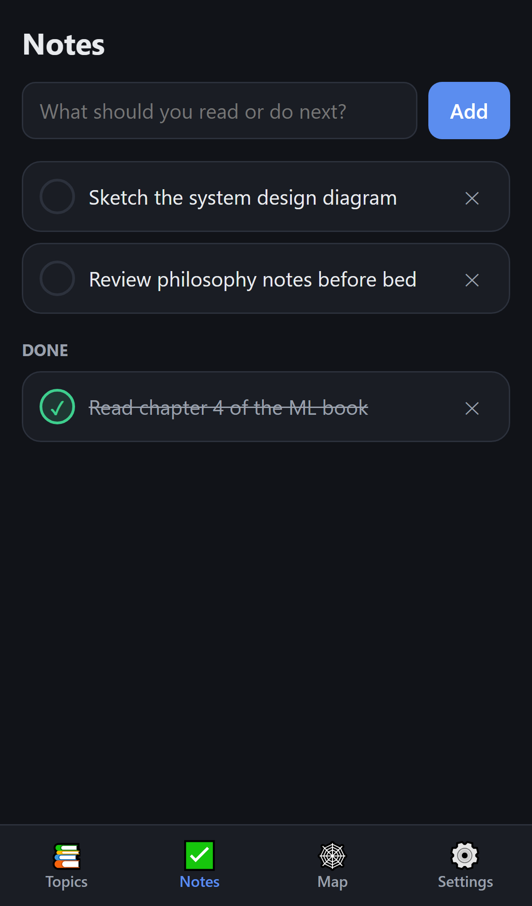
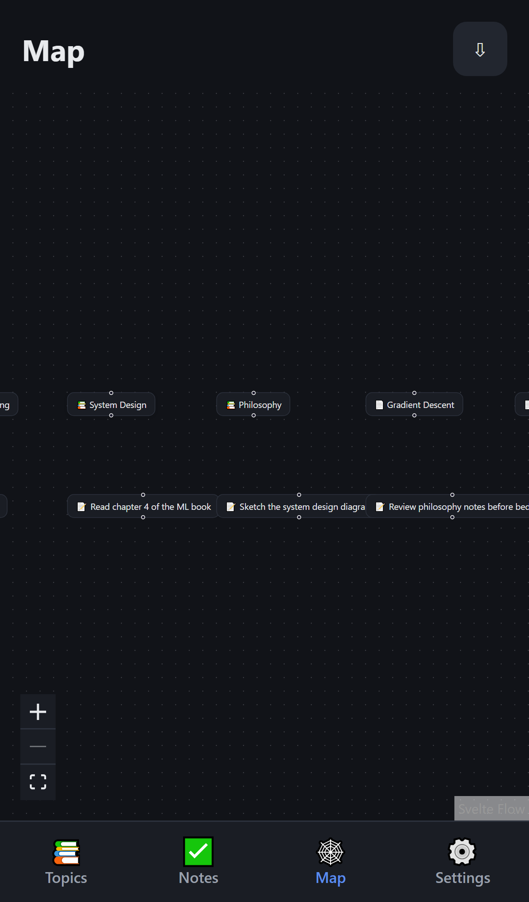
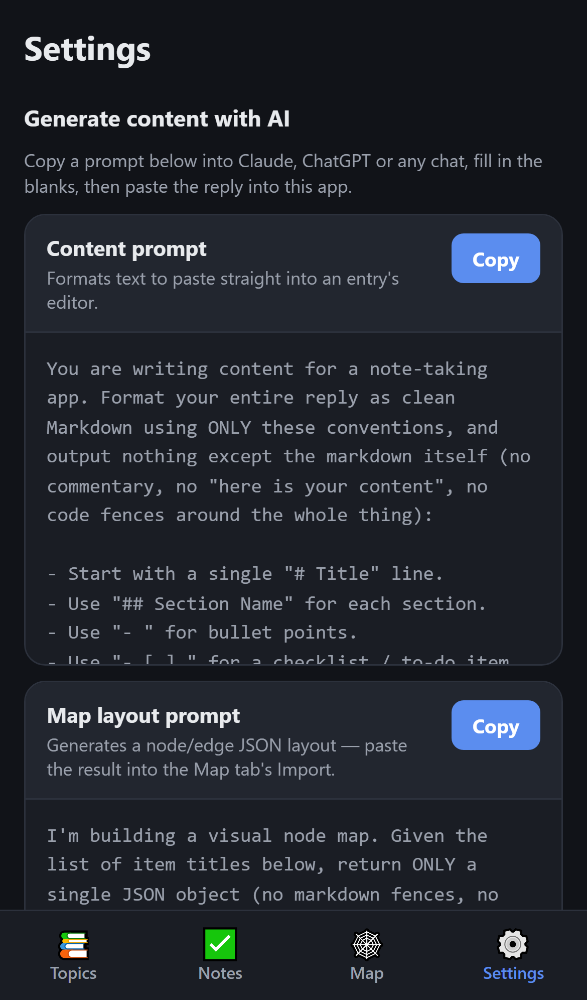

# LearnMo

A minimal, mobile-first space for organizing what you're learning — by topic, with progress you can actually see.

Write things down under the topic they belong to, mark each piece as done when you've finished it, keep a running list of what to read next, and see how it all connects on a visual map. No accounts, no sync, no clutter — it lives on your phone and stays there.

## Features

### 📚 Topics, organized
Group your reading and notes into topics. Every topic shows a live progress bar — at a glance, see how much of it you've actually finished.



### 📝 A real editor, built for thumbs
Every entry gets a proper writing space: a formatting toolbar (headings, bold, lists, checklists, quotes, links) sized for touch, plus a one-tap preview so you can see exactly how it reads.



### ✅ Done, when it's done
Mark any entry as done the moment you finish it. Come back later, pick up where you left off, and keep editing — nothing is ever locked.



### 🗒️ Notes & what's next
A dedicated space for loose tasks and a "read next" queue — separate from your topic content, so it never gets lost in the shuffle.



### 🕸️ See how it all connects
Every topic, entry, and note appears automatically on an interactive map. Drag things into place, draw your own connections, and pinch to zoom — your whole knowledge base, laid out the way you think about it.



### ⚙️ Work faster with AI
Ready-made prompts you can copy into any AI chat to draft content or generate a tidy map layout — then paste the result straight back in.



## Getting started

```bash
npm install
npm run dev
```

Open the printed local URL on your phone (same Wi-Fi network) or in a desktop browser with device emulation. Everything you add is saved on-device automatically — no setup, no sign-in.

To build for production:

```bash
npm run build
npm run preview
```

Because it's an installable Progressive Web App, you can add it to your phone's home screen straight from the browser and use it like any other app — including offline.
